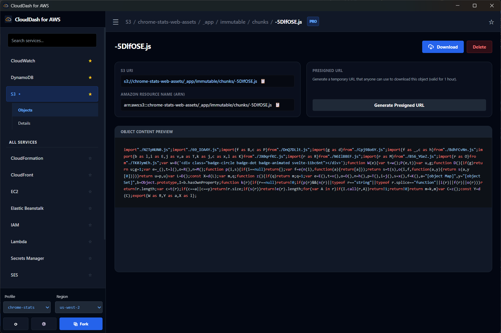
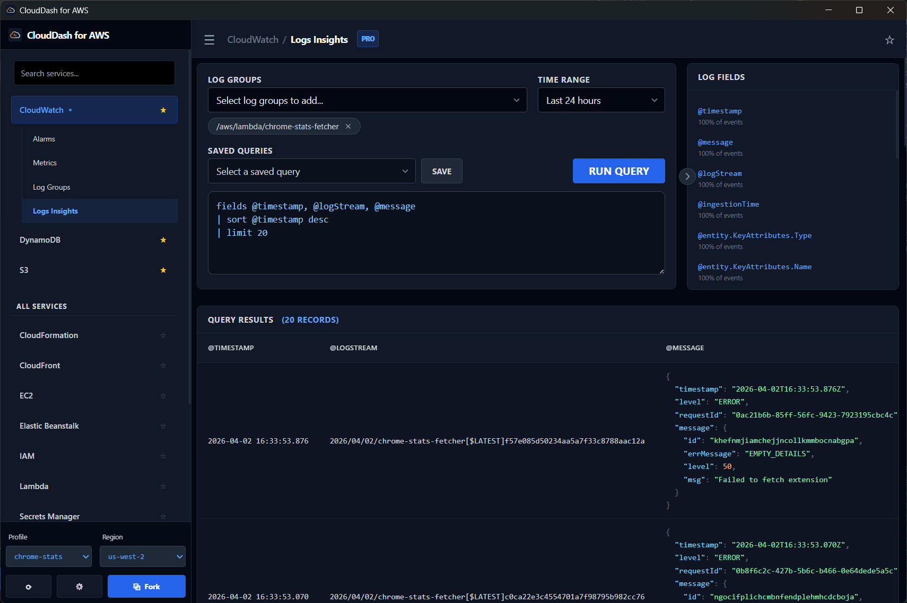
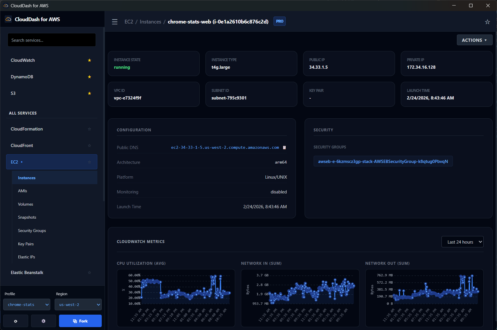

# CloudDash for AWS

CloudDash for AWS is a local-first AWS management dashboard built with Tauri, SvelteKit, TypeScript, and Rust. It is designed for developers and operators who want a fast native interface for day-to-day AWS work without moving their cloud credentials, profiles, or operational data into a hosted team service.

This repository contains the CloudDash app source code, including the desktop shell, frontend UI, Tauri commands, AWS service integrations, and release automation. Official builds are published from this repository through GitHub Releases.

Official Website: [clouddash.dev](https://clouddash.dev/)

## Screenshots

## Project Goals

- Keep AWS profiles and user data local.
- Provide native desktop builds for Windows, Linux, and macOS, plus Android builds where supported. iOS builds are not available until we have more funding.
- Make the source available so users can inspect, build, and contribute to the app.

## Sponsorship

CloudDash development is sponsored by [Chrome-Stats](https://chrome-stats.com/), a platform for researching Chrome extensions, browser ecosystem data, and extension market trends.

If CloudDash is useful to you or your company, please consider sponsoring the project. Sponsorship helps pay for code signing, release infrastructure, CI builds, test devices, security maintenance, and the time required to keep CloudDash improving.

You can support the project by using the GitHub Sponsors button available on this repository, sharing feedback, reporting issues, and contributing patches.

## License

This repository is licensed under the Functional Source License, Version 1.1, ALv2 Future License (`FSL-1.1-ALv2`). Current releases are Fair Source / source-available, not OSI-approved open source.

Each version becomes available under Apache License 2.0 on the second anniversary of the date that version was made available. See [LICENSE.md](LICENSE.md) and [NOTICE.md](NOTICE.md).

CloudDash trademarks, logos, signing keys, official builds, update endpoints, and distribution infrastructure are not granted under the software license.
